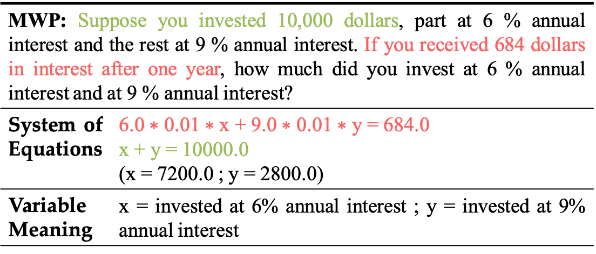
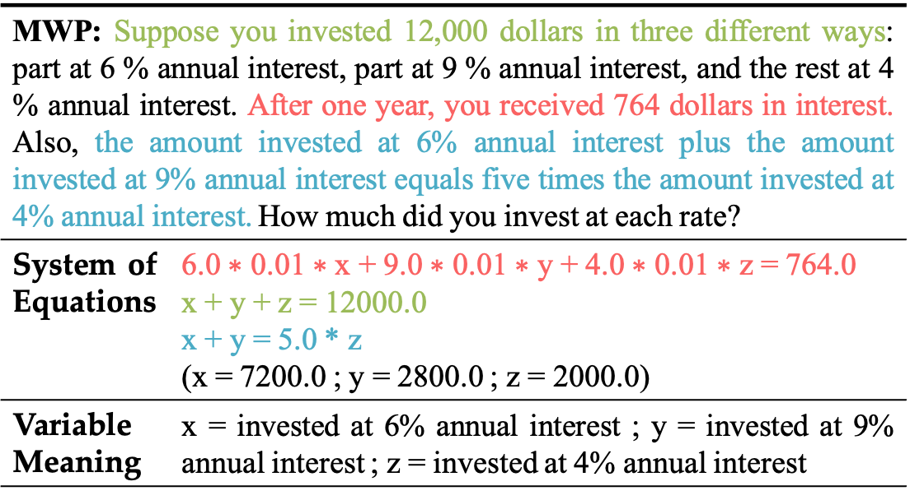
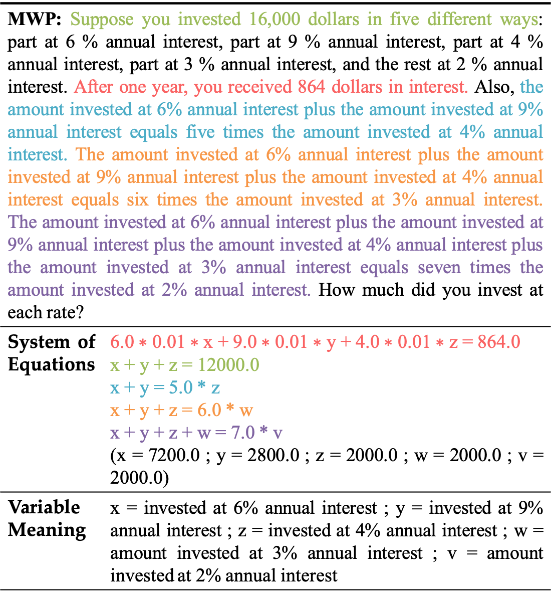

# Formulate-and-Solve

 
 
  
 
 


[EMNLP'24]
This is the official implementation of `Solving for X and Beyond: Can Large Language Models Solve Complex
Math Problems with More-Than-Two Unknowns?`.

Authors: [Kuei-Chun Kao](https://johnsonkao0213.github.io/), [Ruochen Wang](https://ruocwang.github.io/), [Cho-Jui Hsieh](https://web.cs.ucla.edu/~chohsieh/)

[[Webpage](https://johnsonkao0213.github.io/Formulate_and_Solve/)] [[Paper](https://arxiv.org/abs/2407.05134)] [[Huggingface Dataset](https://huggingface.co/datasets/Johnson0213/BeyondX)] [[Leaderboard](https://johnsonkao0213.github.io/Formulate_and_Solve/#leaderboard)] [[Visualization](https://johnsonkao0213.github.io/Formulate_and_Solve/#visualization)] [[Result Explorer](https://johnsonkao0213.github.io/Formulate_and_Solve/#explorer)] 


## Outlines

- [👀 About BeyondX](https://github.com/johnsonkao0213/Formulate_and_Solve/blob/main/README.md#-about-beyondx)
- [👀 About Formulate-and-Solve](https://github.com/johnsonkao0213/Formulate_and_Solve/blob/main/README.md#-about-formulate-and-solve)
- [🏆 Leaderboard 🏆](https://github.com/johnsonkao0213/Formulate_and_Solve/blob/main/README.md#-leaderboard-)
- [📊 Dataset Examples](https://github.com/johnsonkao0213/Formulate_and_Solve/blob/main/README.md#-dataset-examples)
- [📖 Dataset Usage](https://github.com/johnsonkao0213/Formulate_and_Solve/blob/main/README.md#-dataset-usage)
  - [Data Downloading](https://github.com/johnsonkao0213/Formulate_and_Solve/blob/main/README.md#data-downloading)
  - [Data Format](https://github.com/johnsonkao0213/Formulate_and_Solve/blob/main/README.md#data-format)
  - [Data Visualization](https://github.com/johnsonkao0213/Formulate_and_Solve/blob/main/README.md#data-visualization)
  - [Data Construction](https://github.com/johnsonkao0213/Formulate_and_Solve/blob/main/README.md#data-construction)
- [🔮 Evaluations on BeyondX via Formulate-and-Solve](https://github.com/johnsonkao0213/Formulate_and_Solve/blob/main/README.md#-evaluations-on-beyondx-via-formulate-and-solve)
  - [Requirements](https://github.com/johnsonkao0213/Formulate_and_Solve/blob/main/README.md#requirements)
  - [Evaluation Pipelines](https://github.com/johnsonkao0213/Formulate_and_Solve/blob/main/README.md#evaluation-pipelines)
- [📈 Evaluation Results](https://github.com/johnsonkao0213/Formulate_and_Solve/blob/main/README.md#-evaluation-results)
- [📜 License](https://github.com/johnsonkao0213/Formulate_and_Solve/blob/main/README.md#-license)
- [✅ Cite](https://github.com/johnsonkao0213/Formulate_and_Solve/blob/main/README.md#-cite)

## 👀 About BeyondX Construction

**BeyondX** is a novel algebra reasoning benchmark within multi-unknown, which addresses a limitation that existing math datasets are dominated by problems with at most two unknowns. In total, BeyondX includes 464 examples generated from 2 different source datasets (ALG514 and DRAW-1K). The dataset is constructed via a novel approach called Progressive Expansion, which applies a divide-and-conquer strategy:
1. **Scenario Diversification:** Begin by expanding existing simpler problems to increase scenario diversity.
2. **Incremental Expansion:** Instead of expanding problems from 1-2 unknowns to *N* unknowns in a single leap, incrementally introduce one new variable at a time.
3. **Enhanced Solvability:** The problem expansion is broken into several simpler stages, making the entire generation more tractable for LLMs.

<div align="center">

</div>

## 👀 About Formulate-and-Solve

**Formulate-and-Solve** is an automated prompting method designed for LLMs to solve math problems with an arbitrary number of unknowns. It incorporates a set of principles to instruct LLMs in generating demonstrations automatically and empowers LLMs to translate problems into equations and subsequently utilize external tools (Sympy) to solve them.

<div align="center">

</div>

## Leaderboard
🏆 The leaderboard for the **BeyondX** (464 examples) including three, four, and five unknowns is available [here](https://johnsonkao0213.github.io/Formulate_and_Solve/#leaderboard).

## Dataset Examples

Examples of our dataset under each unknown and original source problem:

1. Source Problem (Two Unknown)



2. Three Unknown



3. Four Unknown


4. Five Unknown



## Dataset Usage

### Data Downloading

All the data examples were divided into three subsets: *BeyondX_3*, *BeyondX_4*, and *BeyondX_5*.

- **BeyondX_3**: 194 examples for three unknowns.
- **BeyondX_4**: 158 examples for four unknowns.
- **BeyondX_5**: 112 examples for five unknowns.

You can download this dataset by the following command (make sure that you have installed [Huggingface Datasets](https://huggingface.co/docs/datasets/quickstart)):

```python
from datasets import load_dataset

dataset = load_dataset("Johnson0213/BeyondX")
```

Here are some examples of how to access the downloaded dataset:

```python
# print the first example on the BeyondX
print(dataset["train"][0])
print(dataset["train"][0]['id']) # print the problem id 
print(dataset["train"][0]['problem']) # print the problem text 
print(dataset["train"][0]['system_of_equations']) # print the system of equations
print(dataset["train"][0]['ans']) # print the answer
print(dataset["train"][0]['source']) # print the data source
```

### Data Format

The dataset is provided in json format and contains the following attributes:

```json
{
    "problem": [string] The problem text,
    "system_of_equations": [list] The system of equations for the problem,
    "ans": [list] The correct answer for the problem,
    "id": [int] The problem ID, e.g., 1,
    "source": [string] The source dataset from which the problem was taken
}
```

### Data Visualization

🎰 You can interactively explore the dataset [here](https://johnsonkao0213.github.io/Formulate_and_Solve/#visualization).


### Data Construction

The **BeyondX** dataset is derived from two collected datasets: [ALG514](https://paperswithcode.com/dataset/alg514) and [DRAW-1K](https://paperswithcode.com/dataset/draw-1k). To efficiently generate a large corpus of multi-unknown problems, we developed a novel pipeline that automatically expands existing problems to *N* unknowns.

```
# dataset_name = {"alg514", "draw1k", "BeyondX_3", "BeyondX_4"}
bash scripts/create_dataset.sh ${dataset_name}
```

## 🔮 Evaluations on BeyondX via Formulate-and-Solve

### Requirements
Make sure you have Python>=3.10 installed on your machine.
```
pip install -r requirements.txt
```

### Evaluation Pipelines

#### Prepare LLMs

##### Set your OpenAI and Gemini API key
```
export OPENAI_API_KEY=(YOUR OPENAI API KEY)
export GEMINI_API_KEY=(YOUR GEMINI API KEY)
```

##### For open-source LLMs
Download your model or get their names for Huggingface. And replace the following path by where you locate your models or your models name.

#### Quick Start for Running Evaluation
```
# model_name = {"gpt3", "gpt4", "gemini"}
# dataset_name = {"BeyondX_3", "BeyondX_4", "BeyondX_5"}
bash scripts/run.sh ${model_name} ${dataset_name}
```

## 📈 Evaluation Results

🐙 For visualization of these results, visit our [exploration](https://johnsonkao0213.github.io/Formulate_and_Solve/#explorer) page.

## License

The new contributions to our dataset are distributed under the [CC BY-SA 4.0](https://creativecommons.org/licenses/by-sa/4.0/) license.

The copyright of the questions belongs to the original authors, and the source of every original question can be found in the `source` field. Alongside this license, the following conditions apply:

- **Purpose:** The dataset was primarily designed for use as a test set.
- **Commercial Use:** The dataset can be used commercially as a test set, but using it as a training set is prohibited. By accessing or using this dataset, you acknowledge and agree to abide by these terms in conjunction with the [CC BY-SA 4.0](https://creativecommons.org/licenses/by-sa/4.0/) license.


## :white_check_mark: Cite

If you find **BeyondX** and **Formulate-and-Solve** useful for your your research and applications, please kindly cite using this BibTeX:
```latex
@misc{kao2024solvingxbeyondlarge,
      title={Solving for X and Beyond: Can Large Language Models Solve Complex Math Problems with More-Than-Two Unknowns?}, 
      author={Kuei-Chun Kao and Ruochen Wang and Cho-Jui Hsieh},
      year={2024},
      eprint={2407.05134},
      archivePrefix={arXiv},
      primaryClass={cs.AI},
      url={https://arxiv.org/abs/2407.05134}, 
}
```

## BeyondX Website

BeyondX website is adapted from [Nerfies website](https://nerfies.github.io) and [MathVista website](https://mathvista.github.io/).

## Website License
<a rel="license" href="http://creativecommons.org/licenses/by-sa/4.0/"></a><br />This work is licensed under a <a rel="license" href="http://creativecommons.org/licenses/by-sa/4.0/">Creative Commons Attribution-ShareAlike 4.0 International License</a>.
